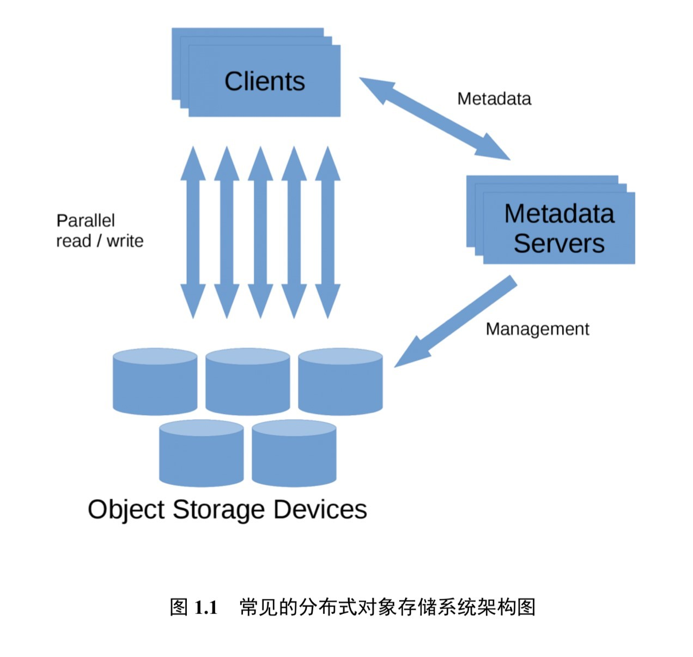
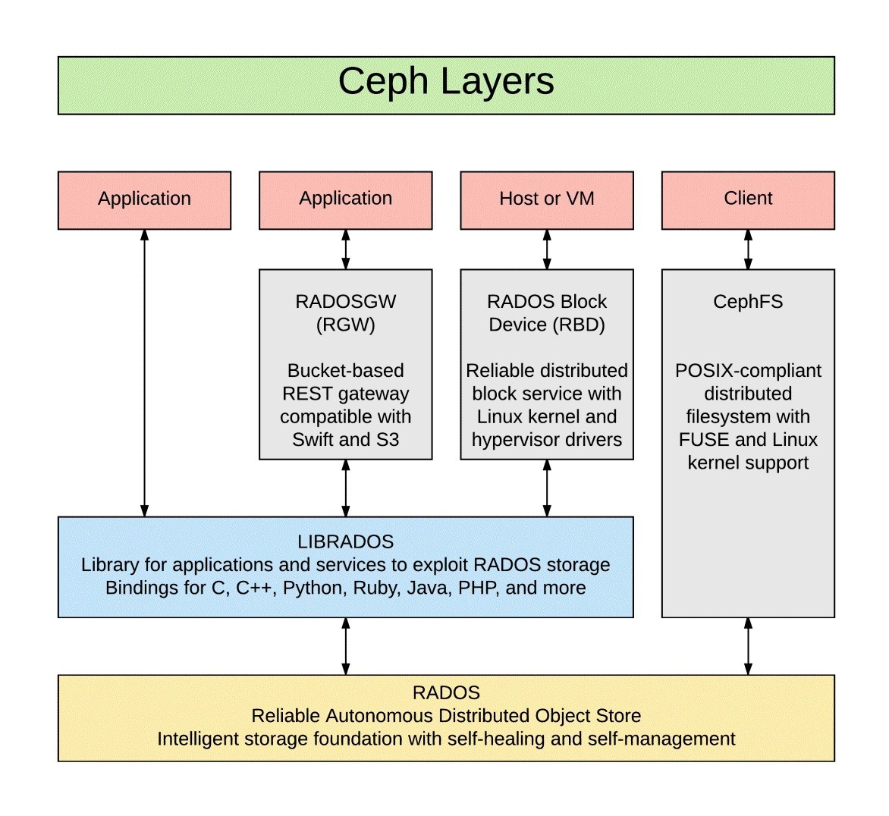
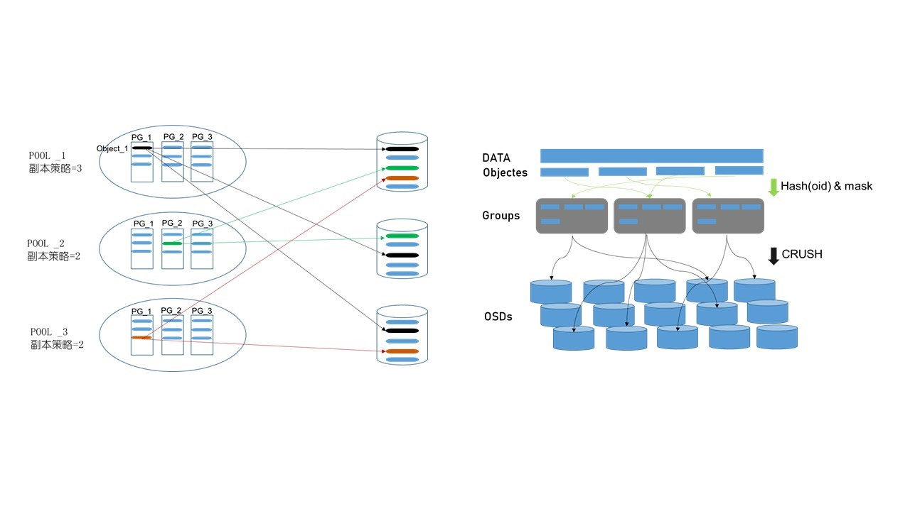
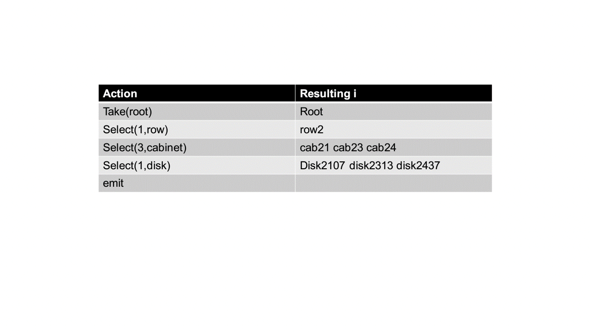
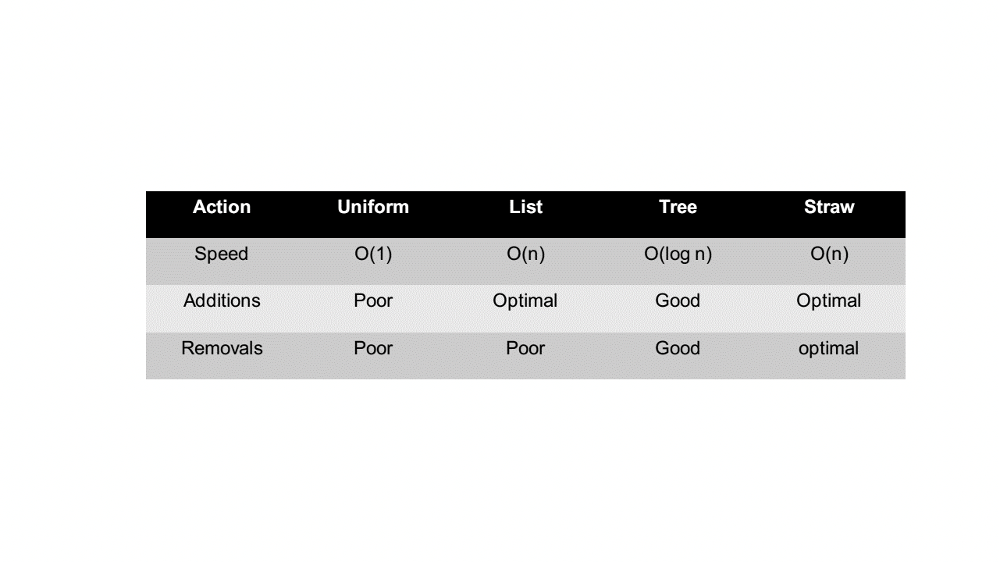

# Lab 4

PDF 版本如下：

OCR 版本如下：

## 实验报告要求

1. 提交一份部署说明文档，一份性能测试和分析文档（若有优化设计更好），无需提交代码
2. 本次实验以大作业分组情况按组完成，每组提交报告至本组大作业的 github 仓库即可，无需单人完成

实验目标：
**完成 Ceph 分布式存储系统的部署，按部署的情况获得基础分数和加分。**

1. 完成单机版部署并进行 I/O 性能测试（8 分，树莓派版本为 10 分）
2. 基于已有部署进行分析，并进行优化和对比测试（2 分，若进行优化，请以配置参数的修改为主，给出相应分析即可，无需修改底层系统）
3. 完成分布式部署并进行 I/O 性能测试（2 分，树莓派版本为 3 分）
4. 基于 docker 完成分布式部署并进行 I/O 测试（2 分）
5. 附加分：将撰写的相关报告提交 csdn 或知乎（1 分）
   注 1： Ceph 自带测试模块，直接使用即可，第三方测试工具同样欢迎。
   注 2：本次实验分数为 10 分，最高不超过 15 分。

## Ceph 背景介绍

随着信息技术的快速发展，互联网产生和处理的数据量迅猛增长。有研究表明，过去两年里产生的数据已经占世界数据总量的 90%。如何存储这些数据是存储系统相关研究的核心问题。传统上的集中式存储系统采用计算能力和 I/O 能力强悍的大型主机进行数据存储，然而目前在数据中心中存储的数据均为 PB 量级甚至更高，传统的集中式存储由于过高的设计和维护成本渐渐难以满足日益增长的存储需求。在目前的数据中心中，普遍采用大量的性价比更高的小型主机，通过分布式文件系统协同存储数据中心中的海量数据，常见的有 Hadoop 分布式文件系统(Hadoop Distributed File System，即 HDFS)和 Ceph 分布式文件系统等，其基础架构如图所示：

## Ceph 基础知识介绍

Ceph 是 Dr. Sage Weil 在其博士毕业论文中设计的开源分布式存储文件系统，经过不断地发展，更多新的特性被加入到当中来。14 年 Ceph 被 Redhat 公司收购，如今已经被广泛用作后端存储系统为上层应用提供支持。该系统被期望设计为没有单点故障的完全分布式存储系统，使数据能容错和无缝的复制，可扩展至 EB 水平(EB, PB, TB, GB)。Ceph 摒弃了传统的集中式元数据寻址方案，取而代之是使用 CRUSH(Controlled Replication Under Scalable Hashing)算法进行数据寻址操作，CRUSH 在一致性哈希基础上很好地实现了容灾隔离，机架感知。扩展性强，理论上支持上千个存储节点。Ceph 支持对象存储，块存储和文件存储，支持自定义接口，多语言驱动，同时其去中心化的设计实现了高可扩展性，副本数量灵活控制实现在不同场景下的高可用性。其基本组件如下：

### Monitor

Monitor 是监控节点，负责收集整个集群状态信息，修复集群故障，管理 Cluster Map，与客户端交互等任务。一个集群拥有一个 Monitor 也可运行，但可能会出现单点故障问题，所以为提高可靠性和可用性一般使用多个 Monitor（官方推荐 3 个），Monitor 之间通过 Paxos 算法保持一致性。monitor 通过 MON 守护进程提供服务。

### OSD

OSD（Object Storage Device）是 Ceph 中负责客户端交互以读写数据的逻辑存储单元。负责在平面命名空间（flatnamespace，区别于目录层次结构）以对象形式存储所有数据。客户端从 Monitor 处得到 map 信息后就只需和相应 OSD 交互以完成读写请求，而无需和中心节点交互，从而提高可靠性并有效利用系统带宽。OSD 和 Monitor 之间通过心跳机制（而不是通过 Monitor 轮询）向 Monitor 通知例如扩容时有新的 OSD 加入，OSD 自身或者其他 OSD 出现故障，Monitor 根据上报信息修改 Cluster 一个集群拥有一个 Monitor 也可运行，但可能会出现单点故障问题，所以为提高可靠性和可用性一般使用 多个 Monitor（官方推荐 3 个），Monitor 之间通过 Paxos 算法保持一致性。 Cluster Map 更新后不会立即直接广播到所有 OSD，而是在 OSD 主动上报信息时将更新信息回复给对方。OSD 之间进行通信时，如果发现对方的 Cluster Map 版本信息较低，则将更新信息发送给对方

### Object

Object 是 ceph 最底层的存储单元，用户写入的数据经过条带化(striping)后由 Ceph 将对象储存在 OSD 中。对象通常大小为 4M，每个都包含一个独一无二的 id，二进制数据和键值对形式的元数据。在同一个命名空间中 Object 是在同一层的，而不是有类似文件系统中的层级结构。对象被进一步组织在 PG(placement group)中方便对 OSD 分配和定位数据。

### MDS

MDS(MetaData Server)是 ceph 的元数据服务器，只是在使用文件系统 CephFS 时需要用到。MDS 是为了给文件系统提供类似树型组织的体系结构而设计的，虽然叫做元数据服务器但并不是负责存储元数据，元数据的存储当作对象存储在 OSD 中，当用户需要查询元数据时，MDS 将 OSD 中数据供用户查询，起到分担代理缓存和接管故障节点的作用。

### RADOS

RADOS(Realiable Autonomic Distributed Object Store)是提供耐久性和可用性的对象存储系统层，为用户直接交互的 Ceph 服务提供支持，是 Ceph 中最底层最核心的组件。RADOS 有无单点故障，可靠性，一致性，可扩展性，自修复，自管理等特性。RADOS 通过 CRUSH 算法恢复组件故障和在扩容时平衡集群系统负载。

### Libradio

Libradio 是 RADOS 提供的库，上层的 RDB. RGW 和 CephFS 均通过此库访问 RADOS，同时当不需要用不到 RDB 等高级特性又想利用 Ceph 已经有的存储，调度，网络进行开发应用时，便可利用 Libradio 进行开发。RADOS 通过 Libradio 提供包括 C, C++, Python, Java, Go 等语言支持的丰富接口。

### RDB

RDB(RADOS Block Device)是提供快存储服务的组件 RDB 是 Ceph 的核心组件，许多站点上 RDB 主要的甚至是使用 Ceph 唯一的应用。RBD 卷操作包括常规的数据读写外还有创建和删除，可以管理快照以进行存档，检查点和派生相关卷。

### RGW

RGW(RADPS Gateway)是为集群提供支持 REST 接口标准的对象存储 服务的组件，支持兼容亚马逊 S3 和 OpenStack Swift 的接口。RGW 使用叫做 radosgw 的 HTTP 服务留守进程与集群交互。

## Ceph 存储机制和读写流程

Ceph 在读写，迁移管理中有两个逻辑概念：pool 和 PG(placement group)o 一个 pool 中包含多个 PG，一个 PG 中包含多个对象，PG 分布在不同 0SD 上，每个对象都对应某个文件，但一个文件一般分为多个对象，对象及其副本放在不同 PG 中。pool 规定了备份本的数量和类型(副本 replicated 和纠删码 Erasure Code)，加入 pool 的概念主要是考虑到故障域隔离，否则 CRUSH 算法将 object 文件均匀分布在整个集群中，当某个磁盘发生故障时，将影响到众多 PG，从而影响到众多的文件，而加入 pool 的概念就能让故障只限定在某一些 PG 中。PG 的引入是为了灵活调整颗粒度，方便对数以百万的对象集中管理，PG 是 pool 的子集。当 PG 过少时，在动态平衡中需要一次性移动大量数据，严重影响系统网络，而当 PG 过多时，移动少量数据也需要大量计算。

当一个文件进行存储时，需要经过两层映射：1.数据文件被条带化为对象后将对象 id 经过过哈希再“与”上掩码(PG 总数-1)得到将要分布的 PG 的 ID；2.将 PG 的 ID 经过 CRUSH 算法后得到一组 OSD，第一个为主 OSD，其他为从 OSD。

读写数据时需要先向 monitor 请求最新的 map 信息，根据 CRUSH 算法请求相应 OSD 节点信息，然后直接和 OSD 交互。在 Ceph 中采用主从模型，读写数据时都需要首先和主 OSD 建立连接，再由主 OSD 同步将数据写入从 OSD，受到从 OSD 的 ACK 应答后再向客户端返回应答，以此保证强一致性。因此，此机制会在数据量较大时造成性能下降。为克服此问题，每个节点包含一个 journal 文件，写数据时先写到 journal 盘中，一定时间后刷新到文件系统中，journal 盘使用读写延迟小的 SSD。

### CRUSH 算法详解

CRUSH(Controlled Replicatin Under Scalable Hashing)算法在 ceph 中是用来决定对象分布的哈希算法，将 PG 映射到一组 0SD 上。在大规模分布式存储系统中执行 PB 级别的分配任务，CRUSH 能够做到平均分配数据和工作负载，以充分利用资源，最大化性能。CRUSH 算法的输入包括三个重要部分，首先是对象的名称等标志性信息。

其次是 cluster map。包含五大部分 Monitor Map, OSD Map, PG Map, CRUSH Map, MDS Map，即整个集群中的配置信息，包含机房，机柜、机架、硬盘等分布信息以及拓扑层次关系。Cluster map 通过树型结构进行组织、中间的节点为 bucket 表示逻辑上一组设备的集合，叶节点则是具体的存储设备。Cluster map 树型结构中每个节点都有自己的权重，bucket 节点权重为子节点权重和，叶节点的权重可根据磁盘容量和 I/O 性能等设置，通过设置权重可以使得对象在空间上能够均匀分布，性能上也使得整个系统达到平衡。

最后是放置策略(placement rules)，该策略规定了在集群中副本放置的数量(默认为三个)，副本在集群中物理上如何分布。例如，将三个副本分别放在不同的机柜，机架，磁盘以提高容灾能力。放置策略步骤为:1.take:从 cluster map 哪一个点开始作为后续操作的起点，即限定了对象及其副本的分布在某个 bucket 中，系统默认为选择 root 节点。2.select:输入将要选择的条目数量和故障域类型然后从选定的起点开始选择，下图展示了将三个副本放置在同一排机柜中三个不同机架中的选择过程。在选择中，规定了四种不同的 bucket 类型，根据不同的类型有不同的伪随机选择算法。四种类型分别为:Uniform, List, Tree, Straw，四种类型的添加和移动的性能如下图。最重要的，使用最多的时 straw 算法。straw 算法采用为每一个 item 计算一个长度，最后选择长度最长的一个作为最终结果返回，形式上相当于抽签。长度的大小等于 PG 的 id 和 item 的 id 作为输入进行哈希的结果再乘上 item 的权重。即（？）之所以加入节点的权重是为了不仅能在拓扑上能够达到平衡和平均分布，也是考虑到节点的容量，I/O 负载等性能指标以此增加高性能节点被选中的概率从而达到性能上的平衡由于选择的结果要求 item 不能相同，所以在出现冲突和失败的场景下 CRUSH 选择重新执行选择算法流程以解决问题。3.emit:返回最终结果。

以下是一次选择过程

### 负载均衡

通过 CRUSH 算法，数据能够均匀地分配到整个 Ceph 存储系统中，当系统进行扩容时，CRUSH 算法也能迅速适应变化并迅速将数据均匀分配。推荐对 ceph 的负载均衡使用 4 层 DR(Direct Routing)模式和 7 层 SNAT 模式。

4 层 DR 模式主要是通过更改目的 MAC 地址将请求分发，实现负载均衡。在这种模式下，调度服务器 Director Server 和真实负责客户端响应的服务器 RS 使用相同的 VIP，这样对 VIP 的请求所有 RS 服务器都可以响应。但这 也意味着所有的服务器都可以响应，那么无法执行负载均衡的决策了，所以在响应对 VIP 的 ARP 请求时，RS 不回应而只让 DIR 回应，这样就可以由 DIR 执行负载均衡策略。当 DIR 收到请求后选择合适的 RS 后将请求的 MAC 地址更换为该 RS 的 MAC 地址，RS 收到该数据包后查看目的 IP 与 VIP 一致于 是进行下一步处理，最后 RS 将数据包直接发送给 client，而不经过 DIR。DR 模式下 DIR 是透明的，即 RS 可以看到来自 client 请求数据包的源地址，DR 模式需要负载均衡服务器和真实应用服务器在一个二层可达的环境。DR 模式比 NAT 或 HTTP 快 8 倍，DR 也不容易成为性能瓶颈。

七层 SNAT 模式实现在应用层，即基于应用层数据决定转发请求的目的服务器。由于分析建立在应用层，所以需要三次握手完成并拆包分析应用层数据所以速度比 DR 和 NAT 要慢，负载均衡服务器的处理能力也要低。这种模式适用于对不同类型应用层数据请求量不同的场景，例如新闻网站将视频数据，文字数据，音频数据分发到不同的服务器处理，使得网络服务更加智能。七层模式下客户端的地址是应用服务器不可见的，这种模式下负载均衡服务器类似一个代理服务器。
